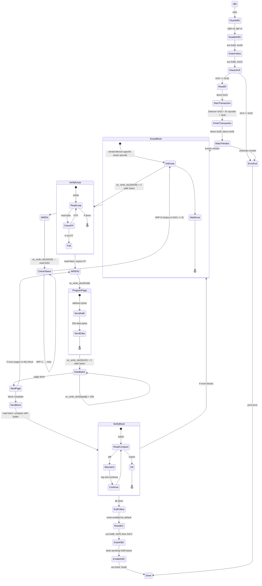
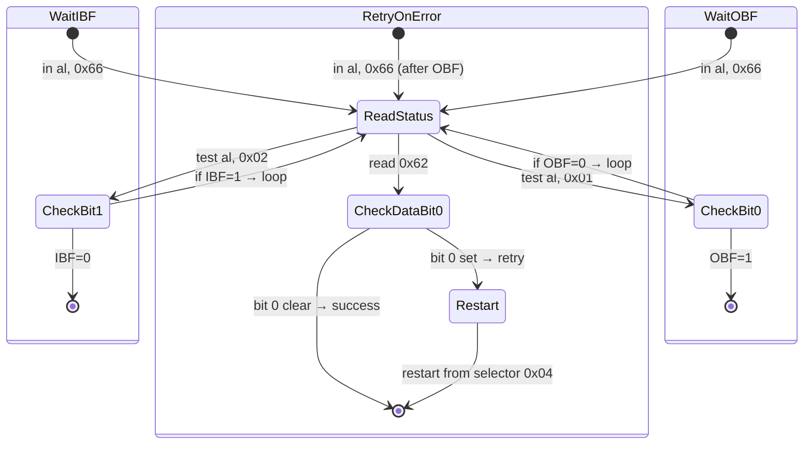

# IT5571 Follow Mode 状态机

## 主流程



## 重试循环



## 块循环

```c
// 基于 64KB 块循环
for (block = 0; block < num_blocks; block++) {
    // 块地址
    block_addr = block * 0x10000;

    // 擦除
    spi_write_enable();
    spi_erase_64k(block_addr);
    verify_erase(block_addr);  // 读取全 block, 检查 FF

    // 编程
    for (page = 0; page < 256; page++) {  // 256 pages per block
        page_addr = block_addr + page * 256;
        spi_write_enable();
        spi_page_program(page_addr, buf + page_addr, 256);
    }

    // 验证
    verify_block(block_addr, buf + block_addr);  // 读回比较
}
```

这个循环解释了为什么用户观察到 4 次擦除/写入/验证 — 256KB 固件 ÷ 64KB = 4 个块。
